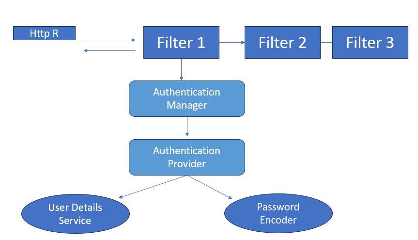

# Spring Security Overview

## What is Spring Security?
Spring Security is a framework for securing web applications. It handles:
- **Authentication**: Verifying user identity.
- **Authorization**: Controlling access to resources based on permissions.

## When to Use Spring Security?
- Protecting web applications with login pages.
- Securing REST APIs.
- Managing user data and permissions.

## Key Components

### 1. Authentication Manager
- Responsible for managing the **authentication process**.
- Validates user credentials through **Authentication Providers**.
- Returns an `Authentication` object if successful.

### 2. Authentication Provider
- Performs the actual authentication logic.
- Supports multiple methods of authentication (e.g., database, OAuth, LDAP).
### 3. UserDetailsService
- Interface to load user data from a data source.
- Returns a `UserDetails` object based on the username.

### 4. UserDetails
- Interface to define user-specific data like:
    - Username.
    - Password.
    - Authorities (permissions).

 

----

# **Spring Security Authentication Manager Overview**

## ProviderManager and AuthenticationProvider
- **ProviderManager**: Core class in Spring Security that manages authentication.
- Configured with a list of one or more **AuthenticationProvider** instances.
- Providers can be defined using XML syntax or standard bean definitions.

## `<authentication-manager>` Element
- **Purpose**: Registers the `AuthenticationManager` responsible for authentication services in the application.
- **Required**: Must be included in every Spring Security application using the namespace.

### Attributes:
1. **alias**: Defines an alias for the internal instance to use in configurations.
2. **erase-credentials**: Clears credentials in the `Authentication` object after successful authentication (`true`/`false`).
3. **observation-registry-ref**: References the `ObservationRegistry` for managing components like FilterChain.
4. **id**: Assigns a unique ID for internal configuration (alternative to `alias`).

### Child Elements:
1. **`<authentication-provider>`**: Configures a specific `AuthenticationProvider`.
  - By default, represents a `DaoAuthenticationProvider`.
  - Loads user details from a `UserDetailsService` and validates username/password.
  - `UserDetailsService` can be defined via:
    - Namespace elements (e.g., `jdbc-user-service`).
    - `user-service-ref` attribute pointing to a bean.

2. **`<ldap-authentication-provider>`**: Configures authentication using LDAP.

## `<authentication-provider>` Element
- Used to configure an individual `AuthenticationProvider`.
- If not using the `ref` attribute, shorthand for `DaoAuthenticationProvider`.

### Attributes:
1. **ref**: Points to a Spring bean implementing `AuthenticationProvider`.

### Parent Elements:
- Must be defined as a child of `<authentication-manager>`.

---

This structure allows flexibility in managing authentication strategies, enabling seamless integration with various data sources like databases or LDAP.

